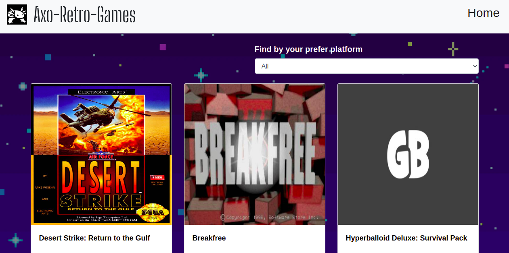

<p align="center">
  <a href="https://github.com/jcy2704/oop-ruby">
    
  </a>
</p>

<h1 align="center">Axo Retro Game App</h1>

<p align="center">
  <strong>Made by Alan Soto</strong>
  <br>
  Come back to the '80s and '90s with this Retro game finder,  where you might filter games by platform, in which the game runs. For example, Atari, Genesis, SEGA, SNES, etc.  Click on the title to get a detailed product page. If you recognize some of these games, let me tell you that we are getting old. This project is powered by www.giantbomb.com. 
</p>



<hr>

<p align="center">
  <a href="https://github.com/AlanSoto31/retro-game-catalogue/issues">
    
  </a>
   ‎ ‎ ‎ ‎
  <a href="https://github.com/AlanSoto31/retro-game-catalogue/issues">
    
  </a>
</p>

<hr>


## Table of Contents

- [Live Demo](#Live-Demo)
- [Built With](#built-With)
- [🖥️ Getting Started](#getting-Started)
  - [Prerequisites](#prerequisites)
  - [Setup](#setup)
  - [Testing](#testing)
- [👥 Author](#author)
- [🤝 Contributing](#contributing)
- [⭐ Show your support](#show-your-support)
- [Acknowledgments](#acknowledgments)


## Live Demo

[Live version](https://axo-retro-games.herokuapp.com/)


## Built With

- JavaScript
- React
- Redux
- Bootstrap
- Jest
- VS Code


## Getting Started

Get a local copy, type on console...

````
 $ cd <'the location yo want to save the project'>
 $ git clone https://github.com/AlanSoto31/retro-game-catalogue.git
 ````


### Prerequisites

- nodejs 14.16.0


### Setup

1. Go inside the project folder: `cd retro-game-catalogue`.
2. Install dependencies: `npm install`.
4. Start the application: `npm run start`
5. Wait for the server to launch the app.
6. Stop the application: `ctrl + c`


### Testing

1. Go inside the project folder: `cd retro-game-catalogue`.
2. Run the test: `npm run test`.


## Author

👤 **Alan Soto**

- GitHub: [@AlanSoto31](https://github.com/AlanSoto31)
- Twitter: [@Alan_Soto31](https://twitter.com/Alan_Soto31)
- LinkedIn: [Alan Soto](https://www.linkedin.com/in/alan-soto-valle/)


## Contributing

Contributions, issues and feature requests are welcome!

Feel free to check the [issues page](https://github.com/AlanSoto31/retro-game-catalogue/issues).


## Show your support

Give a ⭐️ if you like this project!


## Acknowledgments

- [Microverse](https://www.microverse.org/)


## 📝 License

This project is [MIT](https://opensource.org/licenses/MIT) licensed.
